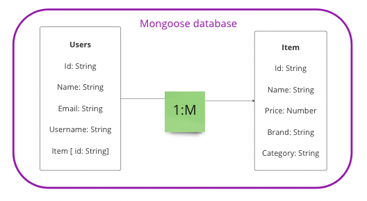

## MERN Mavericks

## Description
MERN Mavericks (a.k.a Massive Engineer Residential Nature) is a website designed to organize and plan out the homes of new homeowners. 

## ERD

## Restful Routing Charts

| URL                      | CRUD   | HTTP verb | Example                                                            |
|:------------------------ | ------ |:--------- |:------------------------------------------------------------------ |
| /                        | READ   | GET       | loads all items                                                    |
| /user                    | POST   | CREATE    | create new user                                                    |
| /user                    | GET    | READ      | get user profile                                                   |
| /item/:id                | GET    | READ      | display one item                                                   |
| /item                    | POST   | CREATE    | create one item                                                    |
| /item/:id                | PUT    | UPDATE    | update one item                                                    |
| /item/:id                | DELETE | DESTROY   | destroy one item                                                   |

## Wireframe and Routing Diagram

## User Stories (MVP)
* As a user I want to see a list of items
* As a user I want to see the details for an item
* As a user I want to create, edit, delete my items

## MVP Goals
* Use the MERN stack
* Provide the users an ability to CRUD
* Display the list of housewares for users to gain inspiration
* Deployed website online

## Stretch Goals
* Allow user to sort items by category and date entered
* Add ability to favorite an item
* Allow user to see all their favorites
* Allow user to associate multiple categories to an item
* Add visually appealing styling
* Add ability to provide product reviews
* Embed websites in the product cards (npm react-iframe)
* Show images on product cards
